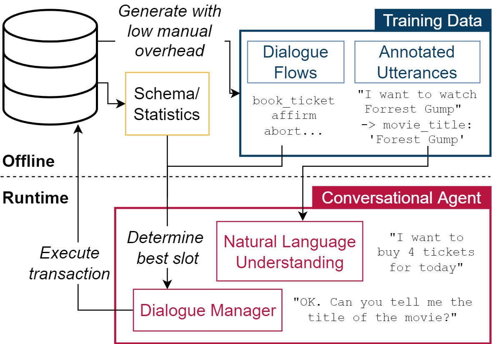

# CAT - Conversational Agents for Database Transactions

Databases for OLTP are often the backbone for applications such as hotel room or cinema ticket booking applications. However, developing a conversational agent (i.e., a chatbot-like interface) to allow end-users to interact with an application using natural language requires both immense amounts of training data and NLP expertise. 

This motivates CAT, which can be used to **easily create conversational agents for transactional databases**. The main idea is that, for a given OLTP database, CAT uses weak supervision to synthesize the required training data to train a state-of-the-art conversational agent, allowing users to interact with the OLTP database. Furthermore, CAT provides an **out-of-the-box integration** of the resulting agent with the database. 

As a major difference to existing conversational agents, agents synthesized by CAT are **data-aware**. This means that the agent decides which information should be requested from the user based on the current data distributions in the database, which typically results in markedly more efficient dialogues compared with non-data-aware agents. 

We publish the code for CAT as open source here.



CAT was presented at VLDB'22. Learn more [in our paper](https://www.vldb.org/pvldb/vol15/p3586-h%C3%A4ttasch.pdf) or [watch our demo video](https://link.tuda.systems/CAT-video).

If you use CAT, please cite it as follows:

```
Marius Gassen, Benjamin Hättasch, Benjamin Hilprecht, Nadja Geisler, Alexander Fraser, and Carsten Binnig. Demonstrating CAT: Synthesizing Data-Aware Conversational Agents for Transactional Databases. PVLDB, 15(12): 3586 - 3589, 2022. doi:10.14778/3554821.355485
```


## Setup

### System requirements

- [Python](https://www.python.org/downloads/) -- tested with Pyton 3.7
- [Node.js](https://nodejs.org/en/)
- Requirements specified in requirements.txt
- To run the configuration UI server refer to the [UI README](./cat-ui/README.md) 

### Environment setup
To install `pip3`, `virtualenv`, the Python packages `npm` modules run `./setup.sh` or proceed manually.

Add user defined functions in `entropy.sql` to your database.

## Usage 

### Configuration backend
The configuration backend allows connecting to arbitrary (currently PostgreSQL) databases and extract the schema's
tables and procedures with their datatypes and foreign key relations.
The backend's API is required to run CAT's configuration frontend for easy schema annotation, task configuration and
response and intent template creation. 

The [server.py](./cat/common/server.py) backend script located in `cat/common/` can be run with the following arguments:

| **Argument** | **Default** | **Usage** |
|----------|---------|---------|
|`-i`/`--interface` | `127.0.0.1` | The interface to listen on |
|`-p`/`--port` | `5001` | The port the API can be reached on |
|`-vv`/`--debug` | `False` | Whether to enable debug mode |
|`-j`/`--jwt_on`| `False` | Whether to enable JWT authentication (use in production)|
|`-s`/`--jwt_secret` | `secret` | Secret to be used for JWT authentication|
|`-a`/`--jwt_passphrase` | `passphrase` | Passphrase to be used for JWT authentication|
|`-c`/`--cors_allowed_origins` | `*` | Allowed origins |


By default the API can be reached on `http://127.0.0.1:5001/api/v1`
Currently there are 3 endpoints
- `auth`: Authentication endpoint if JWT is enabled
    - `login`: Expects the login data (passphrase) and returns an access token
    - `refresh`: Refreshs an access token
- `database`: Connect to and retrieve database schema information, JWT protected if enabled
    - `connect`: Try to establish a connection to a given database
    - `tables`: retrieve tables
    - `tables/{table}`: Retrieve information about a given table
    - `tables/{table}/columns`: Retrieve columns of a given table
    - `tables/{table}/columns/{column}`: Retrieve information about a table's column
    - `tables/{table}/columns/{column}/values`: Retrieve distinct values of a table's column
    - `procedures`: Retrieve information about stored procedures with their parameters and return values
- `nl`: Natural language specific operations
    -  `synonyms/{word}`: Retrieves a list of synonyms for a given word from NLTKs SynSet


### Configuration frontend
The configuration frontend is used to generate tasks. See `cat-ui\README.md` for installation and running instructions.

In short:
- Install dependencies
- serve via `npx ng serve`
- Use the webfrontend (by default available at http://localhost:4200) to create a conversational agent. 

### Running a conversational agent
- Make sure the virtual environment is activated and all requirements are installed 
- Go to the bots directory and run `rasa train` with the domain, config, templates and stories.
    - This will start the core training process for stories in `data/stories.md`
    - This will then start NLU training for training examples in `data/nlu.json`
    - The used configuration and domain are taken from `config.yml` and `domain.yml` respectively 
- Once the models are trained we can run our bot server
    - Run an action server will your custom actions: `python -m rasa_sdk.endpoint --actions actions -vv`, this will be
     used for running actions that the rasa server predicts based on the user input
    - Start the Rasa server `rasa run` and send messages to the bot over the (REST) API or any other channel 
    - Or combine the CLI with the server startup `rasa shell` 
        - **NOTE**: Depending on the time the execution of a task takes, go to `rasa.core.channels.console` and change
        the `DEFAULT_STREAM_READING_TIMEOUT_IN_SECONDS` to a bigger value then 10s, otherwise the client will timeout if
        the action server takes to long
